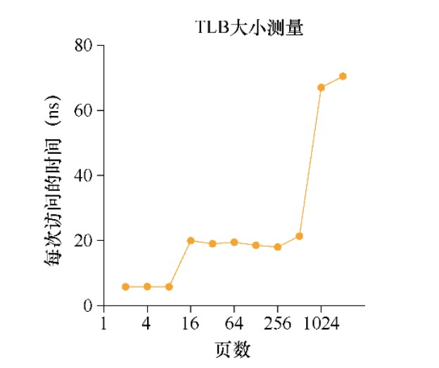

# TLB

本次作业要测算一下 TLB 的容量和访问 TLB 的开销。这个想法参考了 Saavedra-Barrera 的工作，他设计了一个简单而漂亮的用户级程序，来测算缓存层级结构的方方面面。更多细节请阅读他的论文。

基本原理就是访问一个跨多个内存页的大尺寸数据结构（例如数组），然后统计访问时间。例如，假设一个机器的 TLB 大小为 4（这很小，但对这个讨论有用）。如果写一个程序访问 4 个或更少的页，每次访问都会命中 TLB，因此相对较快。但是，如果在一个循环里反复访问 5 个或者更多的页，每次访问的开销就会突然跃升，因为发生 TLB 未命中。

循环遍历数组一次的基本代码应该像这样：

```c
int jump = PAGESIZE / sizeof(int);
for (i = 0; i < NUMPAGES * jump; i += jump)
{
    a[i] += 1;
}
```

在这个循环中，数组 a 中每页的一个整数被更新，知道 NUMPAGES 指定的页数。通过对这个循环反复执行计时（比如，在外层循环中执行几亿次这个循环，或者运行几秒钟所需的次数），就可以计算出平均每次访问所用的时间。随着 NUMPAGES 的增加，寻找开销的跃升，可以大致确定第一级 TLB 的大小，确定是否存在第二级 TLB（如果存在，确定它的大小），总体上很好地理解 TLB 命中和未命中对于性能的影响。

如下是一张示意图。



从图中可以看出，如果只访问少数页（8 或更少），平均访问时间大约是 5ns。如果访问 16 页或更多，每次访问时间突然跃升到 20ns。最后一次开销跃升发生在 1024 页时，这时每次访问大约要 70ns。通过这些数据，我们可以总结出这是一个二级的 TLB，第一级较小（大约能存放 8～16 项），第二级较大，但较慢（大约能存放 512 项）。第一级 TLB 的命中和完全未命中的总体差距非常大，大约有 14 倍。TLB 的性能很重要！

## 问题 1

1、为了计时，可能需要一个计时器，例如 gettimeofday()。这种计时器的精度如何？操作要花多少时间，才能让你对它精确计时？（这有助于确定需要循环多少次，反复访问内存页，才能对它成功计时。）

2、写一个程序,命名为 tlb.c，大体测算一下每个页的平均访问时间。程序的输入参数有：页的数目和尝试的次数。


